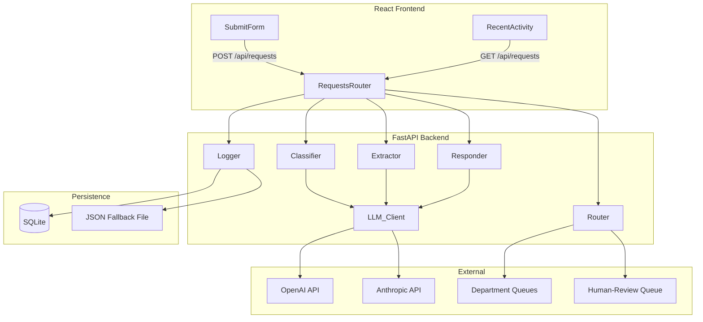
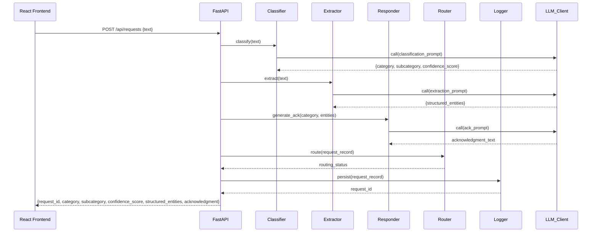

# Design Document: OfficeGenie

## Overview

OfficeGenie is an AI-powered employee support triage system. Employees submit free-text support requests through a React web form. The backend (FastAPI + Python) orchestrates four subsystems — Classifier, Extractor, Responder, and Router — each driven by an LLM (OpenAI GPT or Anthropic Claude) via versioned prompt templates. Results are persisted in SQLite and surfaced back to the employee as a personalised acknowledgment alongside a live "Recent Activity" feed.

### Key Design Goals

- **Separation of concerns**: each subsystem (Classifier, Extractor, Responder, Router, Logger, LLM_Client) has a single responsibility and a well-defined interface.
- **LLM-agnostic**: the LLM provider is selected at runtime via an environment variable; no code changes are required to switch.
- **Resilience**: every external call (LLM API, routing destination) has retry logic and a defined fallback.
- **Testability**: pure business-logic functions are isolated from I/O so they can be property-tested without network calls.

---

## Architecture



### Request Lifecycle



---

## Components and Interfaces

### 1. React Frontend

**Components:**
- `SubmitForm` — text area (10–2000 chars), "Submit to Genie" button, inline validation, loading state.
- `RecentActivity` — ordered list of the 10 most recent session records; prepends new records on success.
- `ApiClient` — thin wrapper around `fetch`; handles `POST /api/requests` and `GET /api/requests`.

**State management:** local React state (no external store needed for MVP).

### 2. FastAPI Backend — `RequestsRouter`

Exposes:
- `POST /api/requests` — orchestrates Classifier → Extractor → Responder → Router → Logger; returns the full response payload.
- `GET /api/requests` — delegates to Logger to fetch the 10 most recent records.

Validation via Pydantic models; returns HTTP 422 on validation failure, HTTP 500 on unhandled errors.

### 3. Classifier

```python
def classify(text: str, llm_client: LLMClient) -> ClassificationResult:
    ...
```

- Calls `LLM_Client` with the classification prompt template.
- Parses the JSON response into `ClassificationResult`.
- If `confidence_score < 0.5`, overrides `category` to `"Other"` and sets `low_confidence=True`.
- On LLM error: returns `ClassificationResult(category="Other", subcategory="Unknown", confidence_score=0.0, error=True)`.

### 4. Extractor

```python
def extract(text: str, llm_client: LLMClient) -> dict[str, str]:
    ...
```

- Calls `LLM_Client` with the extraction prompt template.
- Parses the JSON response; omits keys with null/missing values.
- On malformed JSON: returns `{}` and logs the raw response.

### 5. Responder

```python
def generate_acknowledgment(category: str, entities: dict[str, str], llm_client: LLMClient) -> str:
    ...
```

- Calls `LLM_Client` with the acknowledgment prompt template.
- Validates that the returned string is between 20 and 300 characters.
- Falls back to a generic template if entities are empty.

### 6. Router

```python
def route(record: RequestRecord) -> RoutingResult:
    ...
```

- Looks up the routing destination for the given `category` from a config map.
- If `confidence_score < 0.5` or `category == "Other"`, routes to the human-review queue.
- Retries up to 3 times with 500ms delay on destination failure.
- On total failure: sets `routing_status = "failed"` and logs the error.

### 7. Logger

```python
def persist(record: RequestRecord) -> str:  # returns request_id
    ...
```

- Writes to SQLite; falls back to a local JSON file on DB error.
- Assigns a UUID as `request_id`.

### 8. LLM_Client

```python
def call(prompt: str, schema: dict | None = None) -> str:
    ...
```

- Selects provider (OpenAI / Anthropic) from `LLM_PROVIDER` env var.
- Loads prompt templates from `prompts/` directory.
- Logs model name, prompt tokens, completion tokens, latency.
- On rate-limit: waits 1000ms and retries once.
- On schema mismatch: logs raw response and raises a structured error.

---

## Data Models

### `RequestRecord`

| Field | Type | Description |
|---|---|---|
| `request_id` | `str` (UUID) | Unique identifier |
| `text` | `str` | Original request text (10–2000 chars) |
| `category` | `str` | One of: IT, HR, Payroll, Admin, Facilities, Other |
| `subcategory` | `str` | Refined label within the category |
| `confidence_score` | `float` | 0.0–1.0 |
| `low_confidence` | `bool` | True when confidence_score < 0.5 |
| `structured_entities` | `dict[str, str]` | Extracted key-value pairs |
| `acknowledgment` | `str` | 20–300 char personalised reply |
| `routing_destination` | `str` | Target queue identifier |
| `routing_status` | `str` | "success" \| "failed" |
| `error` | `bool` | True if any subsystem encountered an error |
| `timestamp` | `str` | UTC ISO-8601 |

### `ClassificationResult`

| Field | Type |
|---|---|
| `category` | `str` |
| `subcategory` | `str` |
| `confidence_score` | `float` |
| `low_confidence` | `bool` |
| `error` | `bool` |

### SQLite Schema

```sql
CREATE TABLE request_records (
    request_id        TEXT PRIMARY KEY,
    text              TEXT NOT NULL,
    category          TEXT NOT NULL,
    subcategory       TEXT NOT NULL,
    confidence_score  REAL NOT NULL,
    low_confidence    INTEGER NOT NULL DEFAULT 0,
    structured_entities TEXT NOT NULL,  -- JSON string
    acknowledgment    TEXT NOT NULL,
    routing_destination TEXT NOT NULL,
    routing_status    TEXT NOT NULL,
    error             INTEGER NOT NULL DEFAULT 0,
    timestamp         TEXT NOT NULL
);

CREATE INDEX idx_category   ON request_records(category);
CREATE INDEX idx_timestamp  ON request_records(timestamp);
CREATE INDEX idx_routing_status ON request_records(routing_status);
```

### API Payloads

**POST /api/requests — Request body**
```json
{ "text": "string (10–2000 chars)" }
```

**POST /api/requests — Success response (HTTP 200)**
```json
{
  "request_id": "uuid",
  "category": "IT",
  "subcategory": "Password Reset",
  "confidence_score": 0.92,
  "structured_entities": { "system_name": "VPN", "urgency": "high" },
  "acknowledgment": "Hi, we've logged your VPN issue with the IT team..."
}
```

**GET /api/requests — Response (HTTP 200)**
```json
[
  {
    "request_id": "uuid",
    "text": "I can't access my payslip...",
    "category": "Payroll",
    "subcategory": "Payslip Access",
    "confidence_score": 0.88,
    "structured_entities": { "month": "June", "error_message": "file not found" },
    "acknowledgment": "...",
    "routing_destination": "payroll-queue",
    "routing_status": "success",
    "timestamp": "2025-01-15T10:30:00Z"
  }
]
```

### Prompt Template Files

```
prompts/
  classification.txt   # Variables: {text}
  extraction.txt       # Variables: {text}
  acknowledgment.txt   # Variables: {category}, {entities}
```

Each template instructs the LLM to return a specific JSON schema. Templates are loaded at startup and cached.

---

## Correctness Properties

*A property is a characteristic or behavior that should hold true across all valid executions of a system — essentially, a formal statement about what the system should do. Properties serve as the bridge between human-readable specifications and machine-verifiable correctness guarantees.*

### Property 1: Input validation gates submission

*For any* string submitted to the OfficeGenie form, the "Submit to Genie" button SHALL be enabled if and only if the string length is in the range [10, 2000], and any submission attempt outside that range SHALL be rejected with an inline validation message leaving the activity list unchanged.

**Validates: Requirements 1.2, 1.5, 1.6**

---

### Property 2: Classification output invariant

*For any* valid request text, the Classifier SHALL always return a result where: `category` is one of {IT, HR, Payroll, Admin, Facilities, Other}, `subcategory` is a non-empty string, and `confidence_score` is a float in the closed interval [0.0, 1.0].

**Validates: Requirements 2.1, 2.2, 2.3**

---

### Property 3: Low-confidence override

*For any* LLM response that yields a `confidence_score` strictly below 0.5, the Classifier SHALL override the `category` to "Other" and set `low_confidence` to `True`, regardless of what category the LLM originally returned.

**Validates: Requirements 2.4**

---

### Property 4: LLM error fallback produces safe classification

*For any* LLM error or timeout, the Classifier SHALL always return `category="Other"`, `confidence_score=0.0`, and `error=True` — never raising an unhandled exception.

**Validates: Requirements 2.6**

---

### Property 5: Entities map never contains null values

*For any* LLM response (including malformed or partial JSON), the Extractor SHALL return a `dict` where every value is a non-null string; keys whose values are absent or null in the LLM response SHALL be omitted entirely, and a completely malformed response SHALL produce an empty dict `{}`.

**Validates: Requirements 3.3, 3.4, 3.5**

---

### Property 6: Acknowledgment content and length invariant

*For any* category string and structured entities map (including the empty map), the Responder SHALL generate an acknowledgment that: (a) has length in [20, 300] characters, and (b) contains the category name as a substring.

**Validates: Requirements 4.1, 4.2, 4.5**

---

### Property 7: Routing destination correctness

*For any* `RequestRecord`, the Router SHALL route to the human-review queue if and only if `confidence_score < 0.5` or `category == "Other"`; otherwise it SHALL route to the destination registered for the assigned category in the routing config.

**Validates: Requirements 5.1, 5.2**

---

### Property 8: Router retry and failure status

*For any* `RequestRecord` whose routing destination is persistently unavailable, the Router SHALL attempt delivery exactly 3 times (initial + 2 retries) and then set `routing_status = "failed"` — never more, never fewer attempts.

**Validates: Requirements 5.4, 5.5**

---

### Property 9: Persisted record completeness and uniqueness

*For any* set of N processed requests persisted by the Logger, every stored record SHALL contain all required fields (request_id, text, category, subcategory, confidence_score, structured_entities, acknowledgment, routing_destination, routing_status, timestamp), and all N `request_id` values SHALL be distinct.

**Validates: Requirements 6.1, 6.4**

---

### Property 10: DB failure triggers fallback persistence

*For any* `RequestRecord` that cannot be written to SQLite due to a database error, the Logger SHALL write that record to the local JSON fallback file — ensuring no record is silently lost.

**Validates: Requirements 6.5**

---

### Property 11: Recent activity rendering completeness

*For any* list of `RequestRecord` objects rendered in the Recent Activity component, each rendered entry SHALL display: a text preview truncated to at most 80 characters, the category, the confidence score, and the UTC timestamp.

**Validates: Requirements 7.2**

---

### Property 12: LLM provider selection invariant

*For any* valid value of the `LLM_PROVIDER` environment variable ("openai" or "anthropic"), the LLM_Client SHALL use the corresponding API endpoint and credentials — and SHALL log model name, prompt token count, completion token count, and response latency for every call made under that provider.

**Validates: Requirements 8.3, 8.4**

---

### Property 13: LLM rate-limit retry

*For any* prompt sent to the LLM_Client that receives a rate-limit error, the client SHALL wait 1000ms and retry exactly once before returning an error status — never retrying more than once.

**Validates: Requirements 8.5**

---

### Property 14: LLM schema error returns structured error

*For any* LLM response that does not conform to the expected JSON schema, the LLM_Client SHALL return a structured error object (never raise an unhandled exception) and SHALL log the raw response string.

**Validates: Requirements 8.6**

---

### Property 15: HTTP status code invariant

*For any* request to `POST /api/requests`, the backend SHALL return HTTP 200 when `text` length is in [10, 2000], HTTP 422 when `text` length is outside that range or the body is malformed, and HTTP 500 on unhandled internal errors — and SHALL always include a `Content-Type: application/json` header.

**Validates: Requirements 9.2, 9.4, 9.5**

---

### Property 16: GET /api/requests ordering and limit

*For any* database state containing N records (N ≥ 0), `GET /api/requests` SHALL return at most 10 records ordered strictly by `timestamp` descending (most recent first).

**Validates: Requirements 9.3**

---

## Error Handling

| Scenario | Subsystem | Behaviour |
|---|---|---|
| LLM API timeout / error | LLM_Client | Returns structured error; Classifier falls back to `category="Other"`, `confidence_score=0.0` |
| LLM rate-limit (429) | LLM_Client | Waits 1000ms, retries once; returns error on second failure |
| LLM returns malformed JSON | LLM_Client / Extractor | Logs raw response; Extractor returns `{}`; Classifier returns fallback result |
| Routing destination unavailable | Router | Retries 3× with 500ms delay; sets `routing_status="failed"` on total failure |
| SQLite write failure | Logger | Writes to JSON fallback file; logs DB error |
| Request text too short (< 10 chars) | API / Frontend | HTTP 422 + inline validation message |
| Request text too long (> 2000 chars) | API / Frontend | HTTP 422 + inline validation message |
| Acknowledgment outside length bounds | Responder | Falls back to a template-generated generic acknowledgment |

---

## Testing Strategy

### Approach

OfficeGenie uses a dual testing approach:

- **Unit / example tests** — verify specific scenarios, API contracts, UI rendering, and error conditions with concrete inputs.
- **Property-based tests** — verify universal invariants across randomly generated inputs, catching edge cases that example tests miss.

### Property-Based Testing Library

Use **[Hypothesis](https://hypothesis.readthedocs.io/)** (Python) for all backend property tests. Each property test is configured to run a minimum of **100 iterations**.

Each property test MUST include a comment tag in the format:
```
# Feature: office-genie, Property <N>: <property_text>
```

### Backend Tests (Python / pytest + Hypothesis)

| Test | Type | Properties Covered |
|---|---|---|
| `test_classification_output_invariant` | Property | Property 2 |
| `test_low_confidence_override` | Property | Property 3 |
| `test_llm_error_fallback` | Property | Property 4 |
| `test_entities_no_null_values` | Property | Property 5 |
| `test_acknowledgment_content_and_length` | Property | Property 6 |
| `test_routing_destination_correctness` | Property | Property 7 |
| `test_router_retry_count_and_failure_status` | Property | Property 8 |
| `test_persisted_record_completeness_and_uniqueness` | Property | Property 9 |
| `test_db_failure_fallback` | Property | Property 10 |
| `test_llm_provider_selection` | Property | Property 12 |
| `test_llm_rate_limit_retry` | Property | Property 13 |
| `test_llm_schema_error_structured_response` | Property | Property 14 |
| `test_http_status_code_invariant` | Property | Property 15 |
| `test_get_requests_ordering_and_limit` | Property | Property 16 |
| `test_classifier_example_known_inputs` | Example | Req 2.1–2.3 |
| `test_extractor_known_entities` | Example | Req 3.1–3.2 |
| `test_api_contract_post_success` | Example | Req 9.1 |
| `test_api_contract_get_success` | Example | Req 9.3 |
| `test_llm_template_loading` | Example | Req 8.2 |
| `test_llm_provider_env_var_smoke` | Smoke | Req 8.1 |

### Frontend Tests (React Testing Library + Vitest)

| Test | Type | Properties Covered |
|---|---|---|
| `test_input_validation_property` | Property | Property 1 |
| `test_recent_activity_rendering` | Property | Property 11 |
| `test_submit_button_state` | Example | Req 1.2 |
| `test_loading_indicator` | Example | Req 1.4 |
| `test_acknowledgment_displayed` | Example | Req 4.3 |
| `test_recent_activity_prepend` | Example | Req 7.3 |
| `test_empty_activity_placeholder` | Example | Req 7.4 |

### Integration Tests

- End-to-end `POST /api/requests` with a mocked LLM response verifying the full pipeline (classify → extract → respond → route → log → return).
- `GET /api/requests` after inserting records verifying ordering and field completeness.
- Router retry behaviour against a mock HTTP server that returns errors.

### Test Configuration

```toml
# pyproject.toml
[tool.pytest.ini_options]
addopts = "--hypothesis-seed=0"

[tool.hypothesis]
max_examples = 100
```
